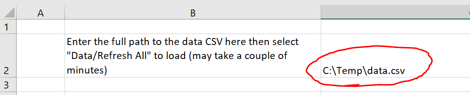
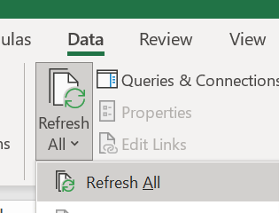
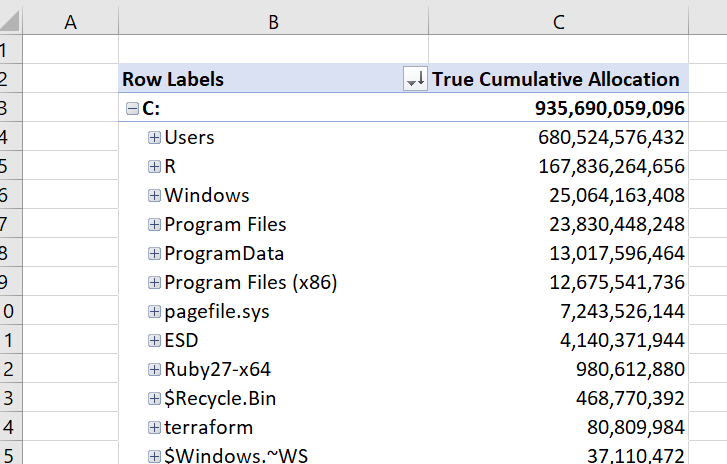

# Can has free space?

A simple tool to understand disk space usage on Windows machines.

Basic usage:

```
Description:
  Generates a CSV of allocation data from Windows file systems.

Usage:
  CanHasFreeSpace [options]

Options:
  -i, --include <include>  A include to read from. If not supplied, will read from the include of the drive hosting this program. [default: C:\]
  -o, --output <output>    A relative or absolute path to the output file. If not supplied, will output to a temporary location. [default: C:\Users\thors\AppData\Local\Temp\CanHasFreeSpace\data.csv]
  --version                Show version information
  -?, -h, --help           Show help and usage information
```

For example:

```
C:\>dotnet CanHasFreeSpace.dll --include c:\test --output c:\test\out.csv
Include:
 c:\test
Output:
 c:\test\out.csv
Completed 112 rows in 00:00:00.0521810
```

Running with no arguments will scan the entire volume the program is on and output to a CSV in a temporary location. This takes about 2 minutes for 3 million
files on my own SSD.

If you see Access Denied errors, some files will not be included in the report. To receive fewer, you might need to run from an elevated command prompt. For the
ultimate error-free run, try executing as SYSTEM with [psexec -sid](https://docs.microsoft.com/en-us/sysinternals/downloads/psexec)

The output CSV contains:

| Field            | Description                                                      |
| ---------------- | ---------------------------------------------------------------- |
| fileId           | A unique identifier for the file (used to deduplicate hardlinks) |
| endOfFile        | The length of the data in the file                               |
| allocationSize   | The space the file takes on-disk                                 |
| extension        | The file extension                                               |
| mimeType         | The MIME type guessed from the extension                         |
| mimeSubtype      | The MIME subtype guessed from the extension                      |
| p00, p01, p02... | The path components                                              |

Example output

```csv
fileId,endOfFile,allocationSize,extension,mimeType,mimeSubtype,p00,p01,p02,p03,p04,p05,p06,p07,p08,p09,p10,p11
138204213565047331,205,208,csv,text,csv,c:,test,data.csv
24488322974539852,0,0,csv,text,csv,c:,test,out.csv
81909218222831898,0,0,,unknown,,c:,test,template
```

The path components are broken out separately for easy analysis using Excel.

## Analyze with Excel

To analyze the file with the included template, copy template.xlsx from the repository to another location then open it with Excel. On the 'Configuration'
sheet, enter the path to a data CSV:



Then select Data/Refresh All



The data should load with status in the bottom right. This might take a few minutes for large CSV. After the data loads, the other sheets show some example
Pivot Tables. For the By Path sheet, you can expand/collapse paths to figure out where space on your drive is being taken.



## Implementation Notes

- Dotnet has a fast cross-platform FileSystemEnumerator, however it does not return the file identifiers needed to correctly add allocation size from hard
  links, so this project instead calls the native Win32 APIs.

- This project uses a single thread to read and a second thread to write. I tried multiple reader threads but observed no performance benefit.

- This project uses the CSV format - I initially tried JSON using Utf8JsonWriter which worked great, but Excel is too slow at processing large JSON files
  compared to CSV.
